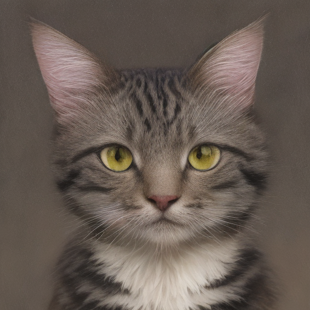

# Mobile Stable Diffusion with DreamDrawer

This is the official repo for the paper "DreamDrawer: Ultra-fast Open-sourced Text-to-Image Generation on Mobile Devices"

**We present a new iOS mobile application, [DreamDrawer](https://testflight.apple.com/join/rL3YXpjO), capable of on-device text to image generation in less than 3s.**

<p align="center">
  
  <i> *Sample images generated within 3 seconds on an iPhone 13 Pro </i>
</p> 

**Note: Safety checking is enforced by default in our mobile application. If you require it to be disabled for debugging purposes, please pull the iOS Mobile App code from the repo and run a new instance of the application on your device.*

The code for the mobile application, the weights, and the model training are all open-sourced and provided in links below. 

All users are welcome to try the application via **[our TestFlight link](https://testflight.apple.com/join/rL3YXpjO)**. We recommend using the application with target devices having equivalent or better hardware specifications than iPhone 13 Pro to achieve a similar experience.


## List of Modules Provided
- [iOS Mobile App Code](https://github.com/ngshikang/DreamDrawer)
- [CoreML Model Weights](https://huggingface.co/davidw0311/sd-coreml)
- [Compilers for Pytorch to CoreML](https://huggingface.co/davidw0311/sd-coreml)
- [Inferencing in Swift](https://huggingface.co/davidw0311/sd-coreml)
- [Pytorch Training Code for Model Size Reduction and Distillation](https://github.com/ngshikang/MobileDiffusionDistillation)
- [Pytorch Training Code for Latent Consistency Finetuning](https://github.com/davidw0311/diffusers)
- [Pytorch Evaluation Code with Human Preference Score V2](https://github.com/ngshikang/MobileDiffusionDistillation)

## Deploying, Compiling, or Inferencing with CoreML

### Directly deploying our pre-trained and compiled weights

Our converted checkpoints can be found on HuggingFace via this link: [https://huggingface.co/davidw0311/sd-coreml](https://huggingface.co/davidw0311/sd-coreml).

### How to convert from your own custom Pytorch model to CoreML Model Weights

The text encoder and VAE encoder/decoder can be converted into CoreML following apple's official repository [https://github.com/apple/ml-stable-diffusion](https://github.com/apple/ml-stable-diffusion).

To convert the unet, we provide a custom script [torch2coreml_custom.py](python_coreml_stable_diffusion/torch2coreml_custom.py), which is customized specifically for converting a distilled model with a new unet. To perform the conversion, run the following snippet:

```
export PYTORCH_UNET_PATH=<path_to_pytorch_unet>
export COREML_UNET_SAVEPATH=<path_to_save_coreml_unet>
```
replacing <path_to_pytorch_unet> with the path to the pytorch unet checkpoint, and <path_to_save_coreml_unet> with where the converted model will be saved. Then, execute:


```python
python -m python_coreml_stable_diffusion.torch2coreml_custom --convert-unet --model-version "lykon/absolutereality" -o $COREML_UNET_SAVEPATH --unet-path $PYTORCH_UNET_PATH --compute-unit CPU_AND_NE --quantize-nbits 6 --attention-implementation SPLIT_EINSUM
```

After the model has been converted into a CoreML .mlpackage, run the following to compile to a .mlmodelc file

```
xcrun coremlcompiler compile <path_to_mlpackage> <output_dir>
```
replacing <path_to_mlpackage> with the path of the .mlpackage file and <output_dir> 

### Implementating LCM Scheduler for our new model or your own LCM

The Latent Consistency Sheduler is added to the implementation in [Scheduler.swift](swift/StableDiffusion/pipeline/Scheduler.swift)

Building off of Apple's framework, we can now directly use the lcmScheduler option to choose LCM as the scheduler.

### Using the CoreML models for inferencing

First, export the path to the compiled coreml models.

```
export COREML_MODELS_PATH=<path_to_models>
```
replacing <path_to_models> with the absolute path to the models folder


Then generate an image using
```python
swift run StableDiffusionSample "a cat" --resource-path $COREML_MODELS_PATH --seed 123456 --disable-safety --compute-units cpuAndNeuralEngine --step-count 4 --output-path images --scheduler lcm --guidance-scale 1.0
```

On a macbook, the first time loading the model may take a few minutes, and subsequent image generation should take only a few seconds.

<p align="center">
  
</p>

The generated images will appear in the [images](images) folder, tagged with their name and random seed.

# Model Training 

Our training for a new smaller UNet model can be found at [this repo](https://github.com/ngshikang/MobileDiffusionDistillation).

Our [LCM fine-tuning script](https://github.com/davidw0311/diffusers/blob/lcm-distillation/examples/consistency_distillation/train_lcm_distill_sd_wds.py) for less inference steps can be found at [this repo](https://github.com/davidw0311/diffusers).

# Model Evaluation

Our [evaluation script](https://github.com/ngshikang/MobileDiffusionDistillation/blob/main/src/generate_distilled_lcm_hpsprompt.py) for a new model using Human Preference Score V2 can be found at [this repo](https://github.com/ngshikang/MobileDiffusionDistillation), or you can refer to the original [HPS V2 repo](https://github.com/tgxs002/HPSv2).

# Acknowledgments
- [National Supercomputing Centre (NSCC) Singapore](https://www.nscc.sg/) for their GPU resources.
- [CompVis](https://github.com/CompVis/latent-diffusion), [Runway](https://runwayml.com/), [CivitAI, Lykon](https://civitai.com/user/Lykon) and [Stability AI](https://stability.ai/) for the Stable Diffusion models.
- [LAION](https://laion.ai/), [Diffusers](https://github.com/huggingface/diffusers), [PEFT](https://github.com/huggingface/peft), [Core ML Stable Diffusion](https://github.com/apple/ml-stable-diffusion), and [Nota AI](https://github.com/Nota-NetsPresso/BK-SDM) for their contributions.
