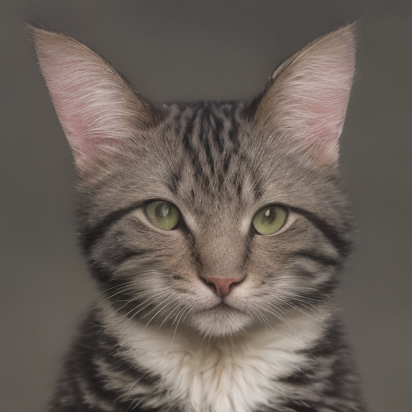

# Mobile Stable Diffusion

> This repository was forked from [https://github.com/apple/ml-stable-diffusion](https://github.com/apple/ml-stable-diffusion)

## We present our app, DreamDrawer, capable of on-device text to image generation in less than 3s

<p align="center">
  
</p>

Our complete training process in Pytorch can be found at [https://github.com/davidw0311/diffusers](https://github.com/davidw0311/diffusers)

Below details the conversion process for Pytorch models into CoreML and deployment into our iOS App:

## Converting Models to CoreML

The text encoder and VAE encoder/decoder can be converted into CoreML following apple's official repository [https://github.com/apple/ml-stable-diffusion](https://github.com/apple/ml-stable-diffusion)

Our converted checkpoints can be found at [https://huggingface.co/davidw0311/sd-coreml](https://huggingface.co/davidw0311/sd-coreml)

To convert the unet, we provide a custom script under [torch2coreml_custom.py](python_coreml_stable_diffusion/torch2coreml_custom.py) specifically for converting the distilled model. 

To perform the conversion, run the following snippet:

```
export PYTORCH_UNET_PATH=<path_to_pytorch_unet>
export COREML_UNET_SAVEPATH=<path_to_save_coreml_unet>
```
replacing <path_to_pytorch_unet> with the path to the pytorch unet checkpoint, and <path_to_save_coreml_unet> with where the converted model will be saved

Then execute
```
python -m python_coreml_stable_diffusion.torch2coreml_custom --convert-unet --model-version "lykon/absolutereality" -o $COREML_UNET_SAVEPATH --unet-path $PYTORCH_UNET_PATH --compute-unit CPU_AND_NE --quantize-nbits 6 --attention-implementation SPLIT_EINSUM
```

After the model has been converted into a CoreML .mlpackge, run the following to compile to a .mlmodelc file

```
xcrun coremlcompiler compile <path_to_mlpackage> <output_dir>
```
replacing <path_to_mlpackage> with the path of the .mlpackage file and <output_dir> 

## Implementation of LCM Scheduler

The Latent Consistency Sheduler is added to the implementation in [Scheduler.swift](swift/StableDiffusion/pipeline/Scheduler.swift)

Building off of Apple's framework, we can now directly use the lcmScheduler option to choose LCM as the scheduler.

## Instructions for Inference

#### First export the path to the compiled coreml models

```
export COREML_MODELS_PATH=<path_to_models>
```
replacing <path_to_models> with the absolute path to the models folder


#### Then generate an image using
```
swift run StableDiffusionSample "a cat" --resource-path $COREML_MODELS_PATH --seed 123456 --disable-safety --compute-units cpuAndNeuralEngine --step-count 4 --output-path images --scheduler lcm --guidance-scale 1.0
```

On a macbook, the first time loading the model may take a few minutes, and subsequent image generation should take only a few seconds.

<p align="center">
  
</p>

The generated images will appear in the [images](images) folder, tagged with their name and random seed.
